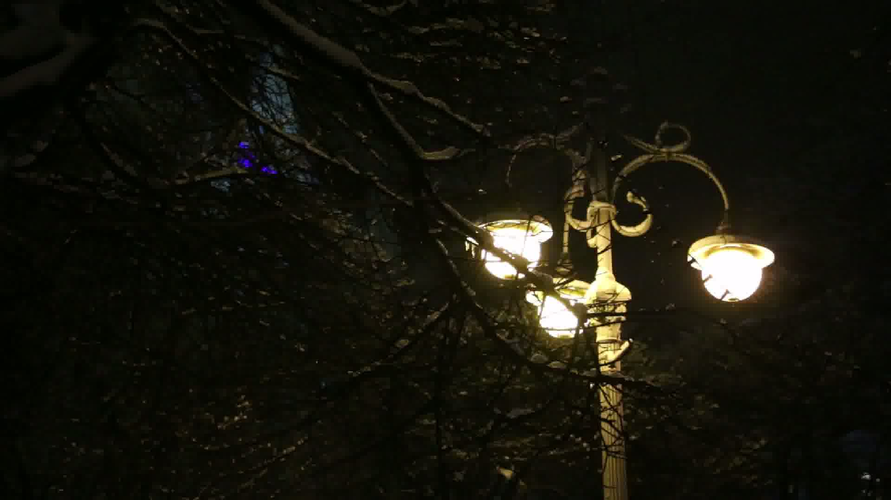

# Wallpaper Engine (It's not anymore)

I wanted to set a video as a background. So, I tried making my own wallpaper engine. 

I thought it will be simple.
 - Connect to XServer
 - Get the root window
 - Make a shared memory buffer
 - Put image data in that buffer and set the Pixmap of the root window.

Turned out to be a big pain very big pain believe me. Plus X11 docs is really bad.. i mean worse.

But, I still wanted to work more on this because I wanted to work with C++ more. The project is not working very good but yeah it just works.

Images used in the repo are for education purpose only.